# KR Auto Trading Lab

[](https://github.com/YoongeonChoi/msp/actions/workflows/ci.yml)
[](https://github.com/YoongeonChoi/msp/actions/workflows/security.yml)
[](https://github.com/YoongeonChoi/msp/actions/workflows/migration-check.yml)

**한국 주식 전략 연구를 안전한 Paper 실행, 복식부기 원장, 운영 승인과 감사까지 연결하는 NO-LIVE 제어 시스템입니다.**

단순히 매수·매도 신호를 만드는 데서 끝나지 않습니다. 어떤 데이터와 전략 버전으로 결정했는지 기록하고, 주문 전후의 위험 조건을 다시 확인하며, 프로세스가 중단돼도 중복 실행 없이 복구할 수 있는지를 시스템 전체에서 다룹니다.

> [!WARNING]
> 이 저장소는 투자 자문, 수익 보장 상품, 고객 자산 운용 서비스가 아닙니다. 현재 지원 환경은 내부 `paper`와 로컬 zero-network `contract_test`뿐입니다. 현재 배포 설정, Execution V2 환경 타입, 데이터베이스 migration 계약, Toss network adapter와 Desktop command surface는 Production Live 주문을 허용하지 않습니다. 회귀·drill용 legacy 모델 일부는 live 형태의 상태를 표현하지만 production order network path로 연결되지 않습니다.

## 왜 만들었나

자동매매 예제는 대개 신호와 API 호출의 정상 경로만 보여 줍니다. 실제 운영에서는 그보다 다음 질문이 더 어렵습니다.

- 같은 신호가 재시도됐을 때 주문이 두 번 생성되지 않는가?
- 오래된 Worker가 lease를 잃은 뒤에도 상태를 변경할 수 없는가?
- 부분체결과 수수료·세금이 원장과 포지션에 정확히 반영되는가?
- 데이터가 나중에 정정돼도 당시 알 수 있었던 정보만 재현할 수 있는가?
- 운영자가 요청·승인·Worker ACK·실제 postcondition을 구분할 수 있는가?
- 정보가 누락되거나 서로 충돌할 때 시스템이 추측하지 않고 멈추는가?

KR Auto Trading Lab은 이 질문을 **fail-closed 불변식과 검증 가능한 증거**로 풀기 위한 모듈러 모놀리스입니다. 수익률보다 안전성, 재현성, 설명 가능성, 관측 가능성을 우선합니다.

## 누구를 위한 프로젝트인가

- 한국 주식 Paper Trading 인프라를 연구하는 개발자
- 전략 결과와 실행·회계 결과를 분리해 검토하려는 퀀트 연구자
- maker/checker, incident, reconciliation 흐름을 설계하는 리스크·운영 검토자
- Python, PostgreSQL, Supabase, React/Tauri를 하나의 E2E 시스템으로 학습하려는 엔지니어

현재 범위는 일반 투자자용 완전 자동매매 앱, 다계정 SaaS, 공식 broker sandbox, 실주문 시스템이 아닙니다.

## 현재 지원 범위

| 영역          | 현재 제공하는 것                                                   | 명시적 한계                                               |
| ------------- | ------------------------------------------------------------------ | --------------------------------------------------------- |
| 실행 환경     | `paper`, 로컬 `contract_test`                                      | Production Live 없음                                      |
| 안전 기본값   | `enabled=false`, `mode=paper`, `live_order_allowed=false`          | 누락된 설정을 자동 보정하지 않음                          |
| 전략          | 설명 가능한 5-factor reference heuristic                           | 검증된 알파·예측 확률이 아님                              |
| Paper V2      | LIMIT/DAY, 정수 주식, 부분체결·만료, 비용, 복식부기                | MARKET, IOC/FOK, modify, short, margin 없음               |
| 데이터        | PIT candle/calendar revision, occurrence, as-of reader, quarantine | 공식 completeness·authenticity·corporate-action 인증 없음 |
| Control plane | Supabase RLS, 좁은 `api` projection/RPC, Worker 전용 `worker_api`  | hosted 운영 증거는 아직 없음                              |
| Desktop       | 상태, 승인, incident, reconciliation, MFA/접근 관리                | signed packaged artifact 없음                             |
| Broker        | Toss 계좌·가격·candle·calendar 등 read-only 경계                   | create/cancel/modify 네트워크 write 없음                  |
| AI            | 뉴스 분류와 연구 후보 제안                                         | 주문 실행·전략 승격 권한 없음                             |
| 배포          | 수동 Render Background Worker blueprint                            | 실제 배포 완료를 의미하지 않음                            |

기업 운영 stage gate는 숫자형 QA와 별개입니다. 현재 `G0`, `G1`, `G2`는 모두 `FAIL`이며 Production Live는 `NO-GO`입니다. 판정 근거는 [G0 Operating Boundary](docs/G0_OPERATING_BOUNDARY.md)와 [Enterprise Trading Program Plan](docs/ENTERPRISE_PROGRAM_PLAN.md)에 있습니다.

## End-to-End 설계와 현재 연결 상태

```mermaid
flowchart LR
    Provider["Read-only providers"] -->|"default-off one-shot"| Collector["명시적 수집 경계"]
    Collector --> PIT["PIT candle / calendar evidence"]
    PIT -.-> Research["Explicit research assembly<br/>(not runtime-wired)"]
    Research -.-> Candidate["Reviewed execution candidate<br/>(no automatic promotion)"]
    Candidate --> Decision["Versioned decision evidence"]
    Decision --> Risk["RiskService policy conjunction"]
    Risk --> Reserve["DB reserve + semantic dedupe"]
    Reserve --> Simulator["Paper or zero-network contract_test"]
    Simulator --> Observation["Immutable observation"]
    Observation --> Ledger["Balanced ledger + projection"]
    Ledger --> API["Data-minimized api projection"]
    API --> Desktop["Tauri operations cockpit"]
    Desktop --> Command["Request · review · step-up"]
    Command --> Worker["Lease-bound Worker claim"]
    Worker --> Ack["ACK + runtime postcondition"]
    Ack --> API
    Ledger --> Outbox["Transactional outbox"]
    Outbox --> Receiver["Authenticated HTTPS receiver"]
```



실선은 구현된 경계 사이의 연결을, 점선은 명시적으로 호출할 수 있지만 정상 runtime·scheduler에는 자동 연결되지 않은 구간을 뜻합니다. 각 trust boundary는 권한을 다시 검증하고 다음 구성요소에 필요한 최소 권한만 전달합니다.

1. Provider adapter는 검토된 read 작업만 수행합니다.
2. 연구 점수는 주문 권한이 아니라 decision evidence입니다.
3. `RiskService` 결과만으로도 충분하지 않습니다. DB가 lease, fencing token, `control_epoch`, 자원과 중복 조건을 원자적으로 다시 확인합니다.
4. Paper 또는 zero-network `contract_test`에서 검증된 execution observation만 accounting transaction으로 연결됩니다.
5. Desktop은 broker를 호출하거나 원장 테이블을 직접 수정하지 않습니다.
6. 요청·승인·claim·ACK·postcondition은 서로 다른 상태이며 마지막 조건 전에는 완료로 표시하지 않습니다.

## 시스템 구조와 선택 이유

```text
apps/worker/      Python application/domain/port/adapter trading engine
apps/desktop/     Tauri 2 + React + Vite operations cockpit
packages/shared/  UI-facing TypeScript schemas
supabase/         PostgreSQL migrations, RLS, RPC, Realtime, seed
docs/             Architecture, policy, runbook, QA, decision records
.github/          CI, security, dependency and migration guards
render.yaml       Manual-deploy Background Worker blueprint
```

### Python Worker

거래 cycle, 위험 평가, Paper 체결, reconciliation과 outbox를 서버 측 한 프로세스에 둡니다. Ports and Adapters 경계를 사용해 domain 규칙이 Supabase, Toss, OpenDART, OpenAI 같은 외부 시스템에 직접 의존하지 않도록 했습니다.

### Supabase와 PostgreSQL

원자 예약, idempotency, 불변 원장과 maker/checker처럼 경쟁 상태에 민감한 규칙은 데이터베이스가 최종 판정합니다. `private`는 source of truth, `api`는 Desktop용 최소 projection, `worker_api`는 서버 전용 RPC allowlist입니다.

### Tauri + React

Desktop은 주문 엔진이 아니라 운영 Cockpit입니다. publishable key와 개인 Auth 세션만 보유하며, strict schema와 RLS/RPC를 통과한 데이터만 표시합니다. 이전 사용자의 민감 snapshot이 다음 사용자에게 남지 않도록 principal별 cache 경계를 둡니다.

### Render Background Worker

HTTP 요청 수명과 분리된 지속 실행 모델이 trading cycle에 적합해 Background Worker blueprint를 사용합니다. 자동 배포는 꺼져 있고, 배포 여부와 준비 상태는 별도 운영 증거로 판단합니다.

더 자세한 trust boundary와 구성요소 책임은 [Architecture](docs/ARCHITECTURE.md)와 [Context Map](docs/CONTEXT_MAP.md)에 정리돼 있습니다.

## 엔진을 수식으로 이해하기

### 1. 설명 가능한 전략 점수

`WeightedFactorStrategyV1`은 다섯 component score의 정규화 가중합입니다.

- `T`: technical, `F`: fundamental, `M`: market/sector
- `N`: news/event, `P`: portfolio
- `w_i`: 각 component의 무차원 가중치

```math
W = w_T + w_F + w_M + w_N + w_P
```

```math
S_{raw} =
\begin{cases}
0, & W \le 0 \\
\dfrac{w_T T+w_F F+w_M M+w_N N+w_P P}{W}, & W>0
\end{cases}
```

```math
S = \min(1,\max(0,S_{raw}))
```

기본 가중치는 technical `0.35`, fundamental `0.25`, market/sector `0.15`, news/event `0.15`, portfolio `0.10`입니다. 기본 행동 경계는 다음과 같습니다.

```math
Action(S)=
\begin{cases}
BUY, & S \ge 0.68 \\
SELL, & S \le 0.25 \\
HOLD, & \text{otherwise}
\end{cases}
```

이 식은 결과 이유를 분해하기 쉬운 **연구용 기준선**입니다. 현재 provider feature path에는 상수 기반 technical·portfolio 입력이 남아 있고, `confidence`는 통계적으로 보정된 성공확률이 아니라 `final_score`와 같습니다. 따라서 예측 모델이나 검증된 알파로 해석하면 안 됩니다.

### 2. 위험 엔진은 평균이 아니라 논리곱이다

위험 항목을 평균내서 높은 점수로 낮은 점수를 상쇄하지 않습니다. 모드별 필수 정책이 모두 허용해야만 다음 단계로 갑니다.

```math
Allowed_m(x)=\bigwedge_{p\in P_m}p(x)
```

`P_m`은 모든 모드에서 같은 집합이 아닙니다. 현재 구현에서 공통 정책 집합을 `P_common`이라 두면 다음 관계입니다.

```math
P_{paper}=P_{common}
```

```math
P_{live}=P_{common}\cup\{LiveStrategyApproval,Mode,LivePermission,MarketOpen,ProviderHealth,SellQuantity\}
```

```math
Reasons=\{reason_p\mid p(x)=false\},\qquad
Severity=\max_p Severity_p
```

공통 정책은 bot·설정·전략 버전, quote freshness, 계좌 동기화, 주문 금액, 현금, 종목·섹터 노출, 일일 손실·주문 수, 중복, 뉴스 위험, 유동성, 변동성과 cooldown을 검사합니다. legacy live 평가는 여기에 live 승인·mode·permission, 장 개장, provider health와 매도 보유수량 정책을 추가합니다. Paper의 `RiskService` 집합에는 `MarketOpen`, `ProviderHealth`, `SellQuantity`가 없지만, Paper V2의 매도 수량은 이후 원자 reservation에서 보유·예약 가능 수량을 다시 검사합니다. 어느 경계에서도 알 수 없는 노출과 위험을 안전한 값으로 간주하지 않습니다.

### 3. 수량, semantic dedupe와 자원 예약

legacy signal sizing에서 KRW 주문 금액 `A`와 지정가 `L`로 정수 주식 수량을 계산할 때는 다음 식을 사용합니다.

```math
q=\left\lfloor\frac{A}{L}\right\rfloor
```

`A ≤ 0`, `L ≤ 0` 또는 계산된 `q=0`이면 legacy helper는 수량 대신 `None`을 반환합니다. Paper V2는 이 식으로 수량을 새로 만들지 않고, 검토된 양의 정수 `q`를 입력으로 받아 지정가·수수료를 포함한 cash reservation 또는 보유수량 reservation을 원자적으로 검증합니다.

동일한 signal identity와 유효 window를 재시도해도 중복 주문이 되지 않도록 canonical JSON의 SHA-256을 semantic key로 사용합니다. 수량과 지정가는 key가 아니라 동일 key 재요청의 payload 일치 여부에서 별도로 검증됩니다.

```math
K=SHA256(CanonicalJSON(account,environment,strategy,symbol,side,signalWindow,policyVersion))
```

매수 예약금은 승인된 수수료율 `r_b`까지 보수적으로 포함합니다.

```math
R_{buy}=qL+\left\lceil qLr_b\right\rceil
```

매도는 현금 대신 `q`주를 예약합니다. DB는 동일 key의 exact replay, 다른 intent의 semantic duplicate, 같은 key의 payload conflict를 구분하고 현재 lease·fencing token·`control_epoch`를 함께 검사합니다.

### 4. 결정론적 Paper LIMIT 체결

결정이 발생한 분의 bar는 사용하지 않습니다. 첫 가능 시각은 다음 full minute입니다.

```math
t_{eligible}=\lfloor t_{decision}\rfloor_{minute}+1\ minute
```

완료됐고 미래 정보가 아니며 유효기간 안에 있는 1분 bar만 후보가 됩니다. bar `t`의 최대 참여 가능 수량은 거래량의 1%에서 같은 account/symbol이 이미 사용한 수량을 뺀 값입니다.

```math
C_t=\left\lfloor0.01V_t\right\rfloor-q_{other,t},\qquad
q_t=\min(q_{remaining},C_t)
```

이미 사용된 수량이 `⌊0.01V_t⌋`를 넘으면 음수 수량으로 보정하지 않고 invariant 오류로 중단합니다. `C_t=0`이면 해당 bar에서는 체결하지 않습니다.

매수 reference price `R`은 시가가 지정가 이하이면 시가, 그렇지 않고 저가가 지정가에 닿으면 지정가입니다. 매도는 반대 조건을 사용합니다. 체결가는 10 bps의 불리한 slippage를 적용하되 지정가를 침범하지 않습니다.

```math
P_{buy}=\min\left(L,\operatorname{ceilTick}(R(1+0.001))\right)
```

```math
P_{sell}=\max\left(L,\operatorname{floorTick}(R(1-0.001))\right)
```

bar별 잔량만 순차 체결하고, 전체 수량에 도달하면 `filled`, 일부만 체결되면 `partial_filled`, 유효기간이 끝난 잔량만 `expired`가 됩니다.

### 5. 비용, 손익과 복식부기

체결 총액과 승인된 비용 schedule은 다음처럼 계산됩니다.

```math
Gross=qP
```

```math
Commission=\lceil Gross\cdot r_c\rceil,\qquad
Tax_{sell}=\lceil Gross\cdot r_t\rceil
```

부분 매도의 원가 해제와 실현손익은 moving weighted average 원가를 사용합니다. 아래에서 `Q`와 `C`는 매도 전 보유 수량과 총 취득원가, `q`는 `1 ≤ q ≤ Q`인 체결 수량입니다.

```math
CostRelief=
\begin{cases}
C, & q=Q \\
\left\lfloor\dfrac{Cq}{Q}\right\rfloor, & q<Q
\end{cases}
```

```math
TradingPnL=Gross-CostRelief
```

```math
NetRealizedOutcome=TradingPnL-Commission-Tax
```

fill의 `realized_pnl_krw`는 위 순비용 반영 결과입니다. 복식부기 원장의 `REALIZED_PNL` 계정에는 `TradingPnL`을 기록하고, 수수료와 세금은 각각 `FEES`, `TAXES` 비용 계정에 분리합니다. 따라서 원장 계정 하나와 fill의 순실현 결과를 같은 값으로 해석하면 안 됩니다.

모든 accounting transaction은 다음 불변식을 만족해야 생성됩니다.

```math
\sum Debit=\sum Credit
```

현금, 예약 현금, 포지션과 예약 수량은 음수가 될 수 없습니다. 동일 fill sequence의 transaction ID는 결정적으로 생성되므로 exact replay가 원장을 두 번 변경하지 않습니다.

### 6. Point-in-Time 데이터 선택

일봉 `D`는 다음 영업일 정규장 시작 이후 candle과 calendar가 모두 관측돼야 사용할 수 있습니다.

```math
t_{cutoff}=NextBusinessSessionRegularStart(D)
```

```math
t_{available}=\max(t_{candleObserved},t_{calendarObserved})
```

as-of 시각 `T`에서 보이는 후보는 다음 조건을 만족하는 revision뿐입니다.

```math
Eligible(c,T)\iff t_{available}(c)\le T
```

동일 observation clock의 충돌, 과거 hash 재등장, candle/timing identity 불일치는 모두 차단됩니다. 이 경계는 당시 사용 가능했던 source-semantic evidence를 재현하지만, SHA-256 자체가 provider 서명이나 거래소 전체 이력의 완전성을 증명하지는 않습니다.

### 7. Backtest 지표의 범위

경량 연구 도구는 일별 수익률 `r_i`가 `n`개일 때 평균 `\bar r`과 표본 표준편차 `s_r`를 사용합니다.

```math
\bar r=\frac{1}{n}\sum_{i=1}^{n}r_i,\qquad
s_r=\sqrt{\frac{\sum_{i=1}^{n}(r_i-\bar r)^2}{n-1}}
```

```math
SharpeLike=\frac{\bar r}{s_r}\sqrt{252}
```

```math
MDD=\min_t\left(\frac{E_t-\max_{\tau\le t}E_\tau}{\max_{\tau\le t}E_\tau}\right)
```

```math
CAGR=(1+R_{total})^{365/d}-1
```

여기서 `E_t`는 시점 `t`의 equity, `d`는 시작일과 종료일 사이의 calendar day 수입니다. `SharpeLike`는 `n<2`이거나 표본분산이 `0` 이하이면 `None`이며 무위험수익률을 차감하지 않습니다. `MDD`는 drawdown을 `0` 이하의 signed 값으로 보존합니다. CAGR은 `d<365`이면 `None`이고, 구현은 세 지표를 소수점 여섯 자리로 반올림합니다. certified dataset replay가 아직 없으므로 이 결과는 전략 승격이나 미래 수익의 증거가 아닙니다.

## 안전 Quickstart

### 사전 요구사항

- Python 3.12 이상
- Node.js 22.13 이상인 22.x LTS 권장, 또는 24 이상과 npm
- native Desktop을 실행할 때만 Rust stable과 [Tauri 2 prerequisites](https://v2.tauri.app/start/prerequisites/)

실제 API key나 broker credential 없이 Worker mock one-shot과 Desktop 설정 화면을 확인할 수 있습니다.

### Worker mock one-shot

PowerShell:

```powershell
cd apps/worker
python -m venv .venv
.\.venv\Scripts\Activate.ps1
python -m pip install -e ".[dev]"
$env:MOCK_PROVIDERS = "true"
$env:RUN_ONCE = "true"
python -m app.main
```

Bash:

```bash
cd apps/worker
python -m venv .venv
source .venv/bin/activate
python -m pip install -e ".[dev]"
MOCK_PROVIDERS=true RUN_ONCE=true python -m app.main
```

기본값은 `enabled=false`이므로 heartbeat와 provider 상태만 확인되고 주문이 생성되지 않는 것이 정상입니다. 이 명령은 안전한 legacy smoke test이며 Paper V2 원장 qualification은 아닙니다.

### Desktop 개발 화면

저장소 root의 새 terminal에서 실행합니다.

```bash
npm ci
npm run desktop:dev
```

Supabase client 설정이 없으면 앱은 fail-closed 연결 안내를 표시합니다. native Tauri 창은 OS prerequisites를 준비한 뒤 실행합니다.

```bash
npm --workspace apps/desktop run tauri -- dev
```

## Paper V2를 E2E로 실행하려면

안전 Quickstart와 실제 control plane 구성은 의도적으로 분리돼 있습니다.

1. [Supabase Setup](docs/SUPABASE_SETUP.md)의 PG17 preflight와 checksum 검증을 통과합니다.
2. migration과 fail-closed seed를 순서대로 적용합니다.
3. 서로 다른 운영 사용자 두 명을 TOTP AAL2로 등록하고 역할을 분리합니다.
4. Worker에만 서버용 secret을 제공하고 Desktop에는 URL과 publishable key만 둡니다.
5. opening command, execution/cost/calendar/tick/volume/corporate-action evidence, release qualification과 lease를 확인합니다.
6. Paper command의 요청→검토→claim→ACK→runtime postcondition을 확인합니다.
7. 원장 checkpoint, reserve, fill, settlement, reconciliation과 incident evidence를 검토합니다.

Hosted staging 적용과 외부 credential 사용은 별도 승인 없이는 수행하지 않습니다. 자세한 순서는 [Paper Trading Operations](docs/PAPER_TRADING_OPERATIONS.md)와 [Runbook](docs/RUNBOOK.md)을 따르세요.

## 개발에 사용한 QA 체크리스트

QA는 “코드가 존재한다”가 아니라 **커밋된 exact SHA에서 요구사항을 직접 증명했는가**를 평가합니다. 각 세부 항목은 증거가 모두 있으면 전점, 하나라도 없으면 0점인 이진 방식입니다. README에는 반복 실행 순서 10개를 요약하며, 실제 채점의 source of truth는 8개 영역·67개 ID를 가진 [QA Iteration Scorecard](docs/QA_ITERATION_SCORECARD.md)입니다.

```math
QA_{total}=\sum_{k=1}^{8} Score_k\times Weight_k
```

아래 표는 제품 source `02ba9be`를 평가하고
[PR #18](https://github.com/YoongeonChoi/msp/pull/18)의 publication receipt로 확정한
**공개 engineering 기준선**입니다. publication 전 source tree만 기계적으로 평가한
임시 값은 `88.40`이었고, scorecard가 required gate를 통과해 통합된 뒤 DO-7을 포함한
공식 값이 `88.90`으로 확정됐습니다. 당시 67개 ID 중 54개가 PASS, 13개가
MISSING이었습니다. 현재 `develop`의 구현이나 실행 중인 workflow를 이 점수에 미리
합산하지 않습니다. 새 점수는 같은 exact SHA의 기능 검증과 필수
CI·migration·security receipt를 모두 확인하고 scorecard publication까지 완료한 뒤에만
확정합니다. exact run ID, ID별 판정과 채점 경계는
[QA Iteration Scorecard](docs/QA_ITERATION_SCORECARD.md)에 고정합니다. 이 숫자는 Live
준비도와 무관합니다.

| 평가축                  |   가중치 | 기록 점수 | 핵심 점검 내용                                                     | 남은 핵심 항목                                   |
| ----------------------- | -------: | --------: | ------------------------------------------------------------------ | ------------------------------------------------ |
| TS · 거래 안전 경계     |      20% |        96 | NO-LIVE, risk, reservation, lease/fencing, transport               | unknown-write 수동 복구                          |
| FC · 기능 완성도        |      15% |        74 | Worker, Paper V2, control plane, PIT primitive                     | dataset replay, 자동 pipeline, durable scheduler |
| DI · 데이터·연구 무결성 |      10% |        95 | canonical identity, immutable revision, lineage, bounded transport | 공식 corporate-action/full-DQ 인증               |
| OP · 운영 가시성        |      15% |        80 | heartbeat, incident, reconciliation, outbox, receiver ACK          | 독립 dead-man, human ACK, durable scheduler      |
| DT · Desktop 정확성     |      10% |        93 | strict schema, RBAC, maker/checker, cache, accessibility           | packaged visual smoke, signed artifact           |
| TC · 테스트·CI          |      10% |       100 | Worker/Desktop/Rust/migration/security/dependency gate             | exact SHA마다 재검증                             |
| DO · 문서·온보딩        |      10% |       100 | architecture, policy, runbook, API gap, setup, current QA hub      | exact SHA마다 재검증                             |
| MA · 유지보수성         |      10% |        78 | ports/adapters, strict types, shared guards, wiring                | 대형 adapter/SQL 분해, scheduler 응집도          |
| **가중 종합**           | **100%** | **88.90** | engineering trend only                                             | `G0/G1/G2`와 분리                                |

실제 반복 개발에서 사용하는 핵심 확인 순서는 다음과 같습니다. 아래 checkbox는 새 exact SHA를 평가할 때마다 비우고 다시 실행하는 템플릿입니다.

- [ ] 안전 기본값과 Production order network 격리를 확인한다.
- [ ] strategy decision, risk result, feature hash와 정책 버전을 결속한다.
- [ ] semantic duplicate, stale lease/fence/epoch와 자원 경쟁을 차단한다.
- [ ] Paper partial fill, expiry, 비용과 원장 균형을 재현한다.
- [ ] PIT revision·occurrence·as-of·quarantine의 변조와 충돌을 거부한다.
- [ ] Desktop role, maker/checker, stale/offline/session/cache 경계를 검증한다.
- [ ] outbox retry/dead-letter와 receiver 인증 실패가 성공으로 표시되지 않는지 확인한다.
- [ ] Worker test, Ruff, strict mypy, Desktop test/E2E/build, Cargo와 migration replay를 실행한다.
- [ ] 비밀 패턴, dependency, CodeQL, workflow 권한과 migration history를 검사한다.
- [ ] exact SHA의 증거를 기록하고 기능별 점수를 다시 계산한다.

### QA 판정 규칙

체크박스는 기능 코드가 존재한다는 뜻이 아니라, 같은 exact commit SHA에서 요구사항별
직접 검증과 필수 전체 gate가 모두 끝났다는 뜻입니다.

- `[x] 완료`: 요구사항별 자동 테스트 또는 verifier가 성공했고, 같은 exact SHA의
  CI·migration·security receipt까지 확인했다.
- `[ ] 부분`: 구현이나 focused test 일부는 있지만 E2E, restart, fault, runtime wiring,
  전체 gate 또는 exact-SHA receipt 중 하나라도 남아 있다.
- `[ ] 미검증`: 직접 실행 증거가 없거나 다른 SHA의 과거 결과만 있다.
- `N/A (external)`: 승인된 외부 환경이나 실제 운영 사용자가 필요한 항목이다.
  숫자에서 제외할 수 있지만 PASS로 바꾸지는 않는다.

하나의 묶음에 여러 요구사항이 있으면 모두 충족해야 완료입니다. 실패한 세부 조건을
다른 성공 결과로 평균내지 않으며, 새 commit이 생기면 해당 범위의 체크박스를 비우고
다시 검증합니다.

### Durable scheduler 구현에 사용한 QA 체크리스트

아래 항목은 `FC-7`, `OP-11`, `MA-7`을 PASS로 바꾸기 위한 완료 계약입니다.
database migration만 통과해서는 완료가 아니며, Worker adapter·handler·runtime과
정확한 GitHub receipt까지 같은 exact SHA에서 검증해야 합니다.

- [ ] **SC-01 · 고정 작업과 RPC 표면** — `commands`, `execution`, `settlement`,
  `reconciliation`, `outbox` 다섯 작업과 일곱 scheduler RPC만 허용하고, definition마다
  `pending | leased | retry_wait` run이 최대 하나인지 확인한다.
- [ ] **SC-02 · DB clock 권위** — due time, retry 가능 시각과 lease 만료를 caller clock이나
  `asyncio.sleep`이 아니라 PostgreSQL clock으로 판정하고, lock 대기 뒤 시각을 다시
  검사한다.
- [ ] **SC-03 · 이중 lease 결속** — outer Worker lease의 account, holder, fencing token,
  release SHA를 매 호출에 결속하고 inner lease가 outer lease보다 늦게 만료되지 않도록
  검증한다.
- [ ] **SC-04 · rolling-upgrade convergence** — definition 변경 시 `converged`,
  `claimed`, `wait`, `manual_resolution`만 반환하고 recovery 과정이 새 cadence run을
  만들지 않는지 확인한다.
- [ ] **SC-05 · startup drain과 실행 barrier** — 새 outer fencing generation마다
  command drain을 강제하고, settlement·reconciliation 상태가 안전하지 않으면 새
  execution claim을 차단한다.
- [ ] **SC-06 · 동시 claim과 stale writer 차단** — 경쟁 claim에서 winner가 정확히 하나인지,
  duplicate claim, stale revision, 오래된 fencing token과 잘못된 release의 complete/fail이
  상태를 바꾸지 않는지 검증한다.
- [ ] **SC-07 · 비효과 작업의 retry budget** — command, reconciliation, outbox만 각 작업의
  정확한 retry reason과 제한된 attempt·manual replay budget 안에서 재시도되는지 확인한다.
- [ ] **SC-08 · 효과 작업의 unknown-effect 처리** — execution과 settlement는 scheduler가
  자동 재시도하지 않고, 만료·취소·응답 유실을 unknown-effect dead letter로 보존하며
  일반 replay를 허용하지 않는지 검증한다.
- [ ] **SC-09 · reason-bound manual replay** — source revision, definition/failure digest,
  failure reason, replay generation, request UUID와 명시적 확인을 CAS로 결속하고, source를
  바꾸지 않은 새 child만 생성하는지 확인한다. 응답 유실 뒤 같은 semantic request만
  복구할 수 있어야 한다.
- [ ] **SC-10 · Worker persistence authority** — port와 adapter가 account, requested source,
  release, definition과 receipt binding을 RPC 전후에 다시 확인하고, authority drift나
  잘못된 성공 응답을 fail closed하는지 검증한다.
- [ ] **SC-11 · handler deadline과 cancellation** — handler는 inner/outer lease 중 더 이른
  시각에서 안전 여유를 뺀 hard deadline 안에서만 실행하고, safe job timeout과 effectful
  unknown outcome을 서로 다른 오류로 처리한다. 외부 cancellation은 삼키거나 성공으로
  settle하지 않아야 한다.
- [ ] **SC-12 · runtime lifecycle** — startup convergence와 command drain, 한 cycle의 제한된
  순차 claim, handler 밖 shared lock 해제, renewal·shutdown drain·lease release 순서를
  검증하고 기존 in-memory sleep loop가 정상 runtime 권위로 남지 않는지 확인한다.
- [ ] **SC-13 · migration·보안·exact-SHA 영수증** — fresh/populated upgrade, restart,
  lock-wait, conflict-target atomic rollback, checksum, forced RLS, zero runtime table grant,
  empty search path, trusted owner와 zero trading side effect를 검증한다. 같은 exact SHA의
  Worker CI, migration-check, security gate가 모두 성공한 뒤에만 체크하고 점수표를
  다시 계산한다.

직접 증거는 다음 세 층으로 나눕니다.

1. [Scheduler migration contract](apps/worker/app/tests/contract/test_durable_operations_scheduler_migration.py)는
   migration, verifier와 workflow가 요구 계약을 계속 포함하는지 정적으로 고정합니다.
2. [Scheduler database verifier](supabase/verify_durable_operations_scheduler.py)는 disposable
   PostgreSQL 17.6에서 실제 DB 동작을 검증하며
   `FINAL=PASS durable_operations_scheduler_verifier`로 끝나야 합니다.
3. Worker port·adapter·handler·runtime focused test와 전체 Worker suite는 application
   실행 경계를 검증합니다. 이 단계와 exact-SHA GitHub receipt가 없으면 DB verifier가
   성공해도 scheduler 기능은 부분 완료입니다.

Cyber Trusted Access가 필요한 hosted Supabase AAL2 사용자, 실제 alert/archive receiver, 실제 Toss read-only 호출, restore·soak·10거래일 운영은 숫자에서 `N/A (external)`로 제외합니다. 제외는 `PASS`가 아니며 binary stage gate도 바꾸지 않습니다. 전체 배점·ID·증거·다음 구현 순서는 [QA Iteration Scorecard](docs/QA_ITERATION_SCORECARD.md)에서 확인할 수 있습니다.

## 검증 명령

아래 명령 블록은 각각 저장소 root의 새 shell에서 시작합니다. 커밋 전에는
worktree를, 커밋 후에는 base/head의 full SHA와 GitHub run의 `headSha`를 따로
확인합니다.

Worker:

```bash
cd apps/worker
python -m ruff check app
python -m mypy --strict app
python -m pytest
```

Desktop과 Tauri:

```bash
npm ci
npm run desktop:lint
npm run desktop:typecheck
npm run desktop:test
# OS에 맞는 한 줄만 실행
npx playwright install --with-deps chromium # Linux / CI
npx playwright install chromium             # Windows / macOS
npm run desktop:e2e
npm run desktop:build
cd apps/desktop/src-tauri
cargo check --locked
cargo test --locked
cargo build --locked
```

Migration과 repository policy:

```bash
# 커밋 전 local 변경
python .github/scripts/migration_history_guard.py --worktree

# 커밋된 후보: <BASE_SHA>와 <HEAD_SHA>는 검증한 full 40-character SHA로 치환
python .github/scripts/migration_history_guard.py --base <BASE_SHA> --head <HEAD_SHA>

python .github/scripts/repository_safety.py migrations
python .github/scripts/repository_safety.py workflows
python supabase/verify_g1_g2_migration.py
python supabase/verify_pit_candle_revision_store.py
python supabase/verify_pit_daily_candle_timing_store.py
python supabase/verify_pit_source_observation_occurrence_store.py
python supabase/verify_pit_daily_candle_as_of_reader.py
python supabase/verify_pit_calendar_observation_store.py
python supabase/verify_pit_calendar_as_of_reader.py
python supabase/verify_kr_calendar_collection_job_store.py
python supabase/verify_pit_daily_candle_collection_job_store.py
python supabase/verify_durable_operations_scheduler.py
```

`BASE_SHA`는 PR의 검증된 base commit, `HEAD_SHA`는 평가할 commit입니다. 로컬
`origin/main`을 사용할 때는 해당 ref가 의도한 base와 같은 SHA인지 먼저 확인합니다.
PR merge candidate는 GitHub workflow의 base SHA와 merge SHA로 다시 검사합니다.

Branch HEAD의 exact-SHA security receipt 확인 예시(PowerShell):

아래 GitHub receipt 명령에는 [GitHub CLI](https://cli.github.com/) 설치와 해당
repository의 Actions를 읽을 수 있는 계정 인증이 필요합니다. 먼저
`gh auth status`로 현재 host와 권한을 확인하세요.

```powershell
$headSha = (git rev-parse HEAD).Trim()
gh run list --workflow security.yml --commit $headSha --event push `
  --json databaseId,headSha,status,conclusion,url
gh run view <RUN_ID> --json headSha,status,conclusion,jobs
gh run watch <RUN_ID> --exit-status
```

조회된 `headSha`가 `$headSha`와 다르거나 하나의 필수 job이라도 성공하지 않으면
QA checkbox를 완료로 표시하지 않습니다. CodeQL, gitleaks, dependency review,
`npm audit`, `pip-audit`, Bandit과 lock-derived evidence의 정확한 명령은
[security workflow](.github/workflows/security.yml)가 source of truth입니다.

`pull_request` run은 source branch의 `headSha`를 표시하지만 실제 job은 GitHub가
합성한 merge candidate를 checkout합니다. 따라서 PR gate는 별도로 base/head와
checkout commit을 확인합니다.

```powershell
gh pr view <PR_NUMBER> --json baseRefOid,headRefOid,statusCheckRollup
gh run list --workflow security.yml --commit $headSha --event pull_request `
  --json databaseId,headSha,status,conclusion,url
gh run watch <PR_RUN_ID> --exit-status
gh run view <PR_RUN_ID> --log | Select-String 'HEAD is now at'
```

로그의 merge 문구가 위 `baseRefOid`와 `headRefOid`를 가리키지 않으면 오래된
receipt입니다. PR run의 `headSha`만 보고 merge candidate의 exact SHA라고
판정하지 않습니다.

Supabase verifier는 Docker daemon과 disposable PostgreSQL이 필요합니다. 전체
순서의 source of truth는
[migration-check workflow](.github/workflows/migration-check.yml)입니다. CI는
Worker, Desktop, Playwright, Rust, migration replay, dependency audit, secret
scan과 CodeQL을 분리된 fail-closed job으로 실행합니다.

## 알려진 한계와 다음 작업

현재 부족한 기능을 성공처럼 포장하지 않습니다.

1. candle 수집 one-shot은 존재하지만 source→feature→decision 자동 pipeline과 정상 runtime scheduler 연결은 없습니다.
2. restart-safe scheduler의 retry budget, dead-letter와 manual replay가 아직 하나의 응집된 운영 경계로 완성되지 않았습니다.
3. certified dataset registry와 exact code/feature manifest 기반 replay가 없습니다.
4. 공식 corporate-action PIT coverage, adjustment evidence와 독립 verifier receipt가 없습니다.
5. hosted RLS/AAL2 역할 분리, 외부 human alert ACK, immutable archive, restore/soak 증거가 없습니다.
6. 독립 failure-domain dead-man 배치와 signed Desktop artifact/provenance가 없습니다.
7. 실제 Toss 주문 create/status/cancel/modify lifecycle network 경로와 공식 sandbox 인증을 제공하지 않습니다.
8. Git tag와 GitHub Release가 없으며, 현재 manifest version은 개발 단계의 `0.1.0`입니다.
9. Tauri의 Linux GTK/WebKit 전이 경로에는 Dependabot이 보고한 `glib 0.18.5` Medium 경보가 남아 있습니다. 취약한 버전이 병렬로 남지 않도록 호환되는 부모 stack을 확인해 올려야 하며, 근거 없이 경보를 dismiss하지 않습니다.

이 README와 current QA index가 포함된 exact SHA에서 DO-6과 전체 점수를 다시 평가합니다. 이후 우선순위는 `glib` 부모 stack 검증, durable scheduler, unknown-write 운영 qualification, 대형 Worker API/SQL 수직 분해입니다. 외부 provider 계약이 불확실하면 endpoint나 성공 응답을 만들어내지 않고 [API Gaps](docs/API_GAPS.md)에 검증 절차를 기록합니다.

## 개발 workflow

모든 코드·문서·설정 작업은 `develop`에서 시작합니다. 기능 하나를 검증해 원자적으로 커밋하고 `origin/develop`에 push한 뒤, exact HEAD의 CI·migration·security gate와 리뷰를 통과한 merge commit 또는 fast-forward만 `main`에 통합합니다. squash, rebase, force-push로 장기 branch 계보를 바꾸지 않습니다.

변경 전 [Git Rules](docs/GIT_RULES.md), [Coding Standards](docs/CODING_STANDARDS.md), 각 디렉터리의 `AGENTS.md`를 확인하세요. risk, execution, broker, migration과 workflow는 보호 영역입니다.

## 문서 안내

- [Engine](docs/ENGINE.md) · [Risk Policy](docs/RISK_POLICY.md) · [Execution Policy](docs/EXECUTION_POLICY.md)
- [Database](docs/DATABASE.md) · [Supabase Setup](docs/SUPABASE_SETUP.md)
- [Security](docs/SECURITY.md) · [Threat Model](docs/THREAT_MODEL.md)
- [Runbook](docs/RUNBOOK.md) · [Incident Response](docs/INCIDENT_RESPONSE.md)
- [Backtesting Policy](docs/BACKTESTING_POLICY.md) · [AI Upgrade Policy](docs/AI_UPGRADE_POLICY.md)
- [API Connections](docs/API_CONNECTIONS.md) · [API Gaps](docs/API_GAPS.md)
- [Cost Limits](docs/COST_LIMITS.md) · [Observability](docs/OBSERVABILITY.md)
- [Current QA Iteration Scorecard](docs/QA_ITERATION_SCORECARD.md) · [Test Plan](docs/TEST_PLAN.md)

## 보안, 기여와 라이선스

비밀정보, 계좌 식별자, 실제 token, 미공개 취약점은 issue, 문서, 로그나 seed에 올리지 마세요. 보안 경계와 공개 절차는 [Security](docs/SECURITY.md)를 따릅니다.

현재 저장소에는 별도 `LICENSE`와 정식 `CONTRIBUTING.md`가 없습니다. 공개 저장소라는 사실만으로 사용·수정·배포 권한이 부여되는 것은 아닙니다. 기여 절차와 라이선스가 확정되기 전에는 소유자에게 먼저 문의하세요.
