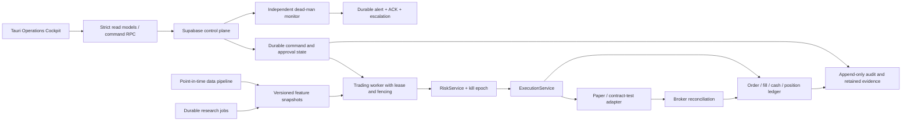

# Enterprise Trading Program Plan

- 문서 버전: 0.1
- 기준일: 2026-07-14 KST
- 기준 소스: `81bcd8dc0484af6f4399dc4929e8444ae01e2aec`
- 프로그램 상태: `EXECUTION STARTED`
- 거래 승인 상태: `LIVE NO-GO`

## 1. 목적과 결론

현재 G1+G2 구현의 법인·계좌·NO-LIVE 경계와 미지정 책임자는
[G0 Operating Boundary](G0_OPERATING_BOUNDARY.md)에 기록한다. 해당 문서의 사람 승인과
운영 증거가 완료되기 전까지 `G0 Program Authorization`은 `FAIL`이다.

이 문서는 `kr-auto-trading-lab`을 기능 시연용 프로젝트가 아니라 실제 자산과
운영 책임을 다룰 수 있는 시스템으로 승격하기 위한 단일 프로그램 기준이다.
기능 목록, 기술 로드맵, 사업 의사결정, 위험 등록부, stage gate, 책임자와
검증 증거를 하나의 실행 체계로 묶는다.

현재 시스템은 안전 우선 연구·Paper MVP로서는 강한 기반을 갖췄다. 그러나
기업용 무인 실거래 시스템으로는 승인할 수 없다. 다음 항목이 특히 중요하다.

1. Paper 현금·포지션이 cycle마다 초기화되고 주문을 의사결정 가격에서 즉시
   체결된 것으로 다룬다.
2. 주문 의도, broker attempt, fill, 수수료·세금, 현금 이동, position lot을
   재구성할 수 있는 불변 원장이 없다.
3. production feature path는 검증된 sector, valuation, news risk, liquidity,
   volatility evidence를 모두 만들지 못하므로 live gate를 안전하게 통과할 수 없다.
4. Desktop의 stop/start 성공은 DB update 성공일 뿐 worker 적용 ACK가 아니다.
5. critical webhook 실패가 지속·재전송·escalation되지 않고, heartbeat가 cycle
   시작 전에 `ok`를 기록한다.
6. 역할, 환경, 감사 원장, 백업·복구, 독립 감시와 규제 경계가 기업 운영
   수준으로 확정되지 않았다.

따라서 다음 90일의 목적은 수익률 확대나 live 기능 활성화가 아니다. 목표는
`회계적으로 참인 Paper/Shadow 환경`, `시점 일관 데이터`, `원자적 실행 안전
커널`, `독립적으로 검증 가능한 운영 통제`를 만드는 것이다.

> 이 문서는 법률 의견이 아니다. 개인 자가매매, 법인 자기자본 운용, B2B
> 소프트웨어, 고객 대상 투자자문·투자일임은 적용 경계가 다르다. 고객 자산이나
> 고객별 투자판단을 다루기 전에 한국 금융·개인정보 전문 법무·준법 검토를
> 완료해야 한다.

## 2. 임시 사업 운영 경계

이번 G1+G2 release train에는 다음 승인 경계를 적용한다.

- 단일 법적 주체의 내부 연구 시스템으로 운영한다.
- 전용 단일 계좌를 전제로 Paper/Shadow 검증까지만 수행한다.
- 외부 고객, 다계정, 투자자문, 투자일임, 수탁, 주문 중개, 데이터 재판매를
  범위에 넣지 않는다.
- OpenAI 출력은 연구·분류·후보 제안에만 사용한다.
- live enable, risk gate 완화, unknown 주문 자동 종결, broker create blind retry를
  금지한다.
- 고객 대상 사업, 다법인·다계좌, 투자자문·일임, 실주문 요구는 이 설계의 다음
  gate가 아니다. 현재 프로그램을 확장하지 않고 새 `G0` 사업·규제 심사를 연다.

### 2.1 2026-07-14 승인된 G1+G2 구현 경계

- 운영모델은 단일 법인 자기자본·전용 단일 계좌로 확정한다.
- 첫 release train은 `G1 Paper Truth`와 `G2 Operational Readiness`를 함께
  구현하되, 외부 환경 적용은 별도 승인 checkpoint에서 수행한다.
- 외부 주문 상한은 공식 OpenAPI에 고정된 로컬 `contract_test` simulator다.
  공개 계약에서 별도 broker sandbox가 검증되기 전에는 실제 주문 endpoint를
  호출하지 않는다.
- Paper 회계는 append-only execution event와 balanced journal을 사용하고,
  다음 full-minute bar, 1% volume participation, 10 bps adverse slippage를 적용한다.
  비용·세금·결제·tick schedule은 승인된 evidence가 없으면 체결을 차단한다.
- Supabase Auth TOTP AAL2를 운영 계정에 강제하고, 위험을 높이는 command와 role
  변경은 서로 다른 requester/reviewer를 요구한다. Emergency Stop은 AAL2 operator
  한 명이 즉시 실행할 수 있다.
- 초기 reliability 목표는 committed ledger RPO 0, market-hours RTO 30분,
  command observed 10초, critical alert human ACK 5분이다.
- Production Live는 이번 release train의 backlog가 아니라 금지 경계다. DB, Worker,
  Desktop, network 중 어느 경로에서도 활성화 효과가 생기면 gate 실패다.

자본시장법 제6조는 투자자문업과 투자일임업을 별도의 금융투자업으로 정의한다.
고객별 투자판단이나 재산 운용으로 범위를 확장하는 행위는 UI 기능 추가가 아니라
사업·인허가 경계 변경으로 취급한다.

## 3. 구현 전 기준선 판정

아래 표와 코드 근거는 G1+G2 실행을 시작할 때의 기준선이며 현재 working tree의
gate 판정이 아니다. 현재 통과 여부는 `G0_OPERATING_BOUNDARY.md`,
`TEST_PLAN.md`와 최신 검증 증거로만 결정한다.

숫자형 scorecard는 개선 추세를 보는 자료로만 사용한다. 외부 증거가 하나라도
부족하면 높은 점수와 무관하게 해당 stage gate는 `FAIL`이다.

| 영역 | 현재 판정 | 실제 근거 | 다음 승인 조건 |
| --- | --- | --- | --- |
| 안전 경계 | `PARTIAL` | `RiskService`, worker-only broker path, idempotency, manual-check, deployment lock 존재 | atomic reservation, kill epoch, lease/fencing, fill ledger |
| Paper 회계 | `BLOCKED` | Paper account가 cycle마다 1천만원으로 초기화 | persistent balanced ledger와 restart reconciliation |
| 데이터·연구 | `BLOCKED` | strict PIT candle 단일-page read 경계만 있고 persistence·revision·DQ·feature 연결은 없으며 production score 일부는 상수·unknown | point-in-time raw data, lineage, DQ gate, certified backtest |
| Live feature evidence | `BLOCKED` | sector 미주입, PER/PBR 없음, news risk unknown, liquidity/volatility evidence 없음 | 검증된 source로만 전체 evidence 생성 |
| Control UX | `PARTIAL` | 안전 큐·승인 UX·audit summary는 존재 | command/ACK state machine, stale/offline guard, strict schema |
| IAM·감사 | `BLOCKED` | 사실상 단일 admin, service role 전권, 감사 삭제/변조 방지 미완성 | 역할분리, MFA/step-up, append-only audit, WORM export |
| 운영·SRE | `BLOCKED` | 단일 worker, 내부 heartbeat, best-effort webhook | external dead-man, durable outbox, SLO, restore drill |
| 환경·릴리스 | `PARTIAL` | 수동 배포·SHA pin·CI 보안 gate 존재 | 완전 분리 staging, build-once/promote, native signing |
| 규제·거버넌스 | `BLOCKED` | 적용성 판단과 통제 매트릭스가 저장소에 없음 | operating-model memo와 법무·준법 sign-off |

### 3.1 구현 전 핵심 코드 근거

- `apps/worker/app/application/use_cases/run_trading_cycle.py`의 Paper account는
  cycle마다 `cash_krw=10_000_000`, `daily_loss_pct=0`, `daily_order_count=0`으로
  생성된다.
- `apps/worker/app/application/services/execution_service.py`는 Paper 주문을
  decision price와 whole-share quantity로 즉시 `paper` 상태로 저장한다.
- `apps/worker/app/application/services/data_collection_service.py`는 명시적인
  단일-page PIT candle read만 수행한다. persistence, pagination, scheduler,
  completed-bar 인증, feature 연결은 아직 없다.
- `apps/worker/app/infrastructure/scheduler.py`는 메모리 loop이며 durable job state,
  lease, retry budget, dead-letter가 없다.
- `apps/worker/app/infrastructure/outbox.py`는 DTO만 있고 alert delivery 경로에
  연결되지 않았다.
- `apps/worker/app/container.py`는 production `FeatureService`에 market-sector
  provider를 주입하지 않는다.
- `apps/worker/app/adapters/fundamentals/opendart_client.py`는 PER/PBR을 만들지
  않으며, `naver_news_client.py`는 news risk를 `unknown`으로 둔다.
- 기존 `apps/desktop/src/lib/rows.ts`는 필수 row 값을 조용히 보정했고,
  `StrategyLabPage.tsx`는 최근 row와 UI heuristic에 의존했다. G1+G2 cutover에서는
  두 경로를 release source에서 제거하고 strict `schema_version: 1` 계약만 남긴다.
- `supabase/migrations/0009_live_operations_hardening.sql`의 일부 audit trigger는
  delete를 기록하지 않으며, `service_role`과 audit sink가 분리돼 있지 않다.

## 4. 목표 운영모델

### 4.1 설계 원칙

1. **Safe unavailability**: 가용성보다 중복·오주문 방지가 우선이다.
2. **Execution truth, local proof**: Paper/contract-test observation과 local ledger는
   모든 관찰·판단·전이를 재현하는 기준이다. 실제 Toss account/market read는
   별도 관측 자료이며 외부 주문 진실을 가장하지 않는다.
3. **No silent defaults**: 위험·회계·권한 데이터의 schema mismatch는 빈 값으로
   보정하지 않고 명시적 장애로 격리한다.
4. **Point-in-time only**: 결정 시점에 이용 가능했던 데이터만 연구와 실행에
   사용한다.
5. **Maker-checker**: 전략 승격, 위험한도 변경, contract-test 활성화, unknown
   종결, release와 역할 변경은 서로 다른 역할이 검토한다.
6. **Build once, promote**: 같은 서명 artifact를 staging에서 검증하고 production에
   승격한다.
7. **One source of execution**: Paper와 로컬 contract-test create/status/cancel은
   worker의 V2 execution kernel 경계에서만 수행한다. Production broker order
   create/status/cancel network path는 존재하지 않는다.
8. **Modular monolith first**: 팀과 부하 근거 없이 microservice를 만들지 않는다.

### 4.2 목표 논리 구조

현재 Python modular monolith는 유지한다. 다만 같은 codebase 안에서 다음 process
role을 분리한다.

- `trading-worker`: 짧고 bounded한 trading cycle, reconciliation, execution
- `data-worker`: raw market/reference/fundamental/news ingestion과 DQ
- `research-worker`: outcome, backtest, monthly research
- `alert-dispatcher`: outbox delivery, retry, escalation
- `external-monitor`: worker와 Supabase 밖에서 liveness를 검사

다중 trading worker는 lease와 fencing이 구현되기 전까지 금지한다. 장애 시 자동
자동 failover보다 안전 정지와 운영자 대사를 우선한다.

### 4.3 필요한 데이터 구성요소

정확한 schema는 별도 ADR과 migration review에서 확정하되, 책임 경계는 다음을
포함해야 한다.

- `accounts`: environment, broker, legal owner, execution scope
- `order_intents`: 전략의 주문 의도와 승인된 risk/config version
- `order_reservations`: semantic idempotency, lease/fencing token, kill epoch
- `order_attempts`: provider dispatch 전후 상태와 request identity
- `order_events`: append-only 상태 전이
- `fills`: quantity, price, commission, tax, filled/settlement time
- `accounting_transactions` + `accounting_postings`: opening capital, fill,
  fee, tax, reserve/release, adjustment의 balanced journal
- `position_lots`: 취득 lot와 realized/unrealized basis
- `reconciliation_runs`와 `reconciliation_breaks`
- `instruments`, `market_sessions`, `corporate_actions`
- `raw_observations`: source event time, observed/ingested time, checksum, license
- `feature_sets`와 `feature_observations`: code/data/config version, as-of
- `job_definitions`, `job_runs`, `job_leases`, `dead_letters`
- `operation_commands`, `command_receipts`, `approval_decisions`
- `incidents`, `alert_deliveries`, `operator_acks`
- `evidence_registry`: environment, artifact hash, release SHA, reviewer

Worker-only raw, ledger, credential-adjacent operation data는 장기적으로 exposed
`public` schema 밖의 private schema로 분리한다. Desktop에는 명시적으로 허용된
read model 또는 좁은 RPC만 노출한다. View가 필요하면 RLS 우회를 방지하는
`security_invoker` 방식을 검토한다.

## 5. Stage gate

| Gate | 목적 | 필수 증거 | 승인권자 | 현재 |
| --- | --- | --- | --- | --- |
| `G0 Program Authorization` | 사업·규제·위험 경계 확정 | operating-model memo, legal perimeter, risk appetite, data/broker rights, team/RACI | Sponsor + Risk + Legal/Compliance | `FAIL` |
| `G1 Paper Truth` | 회계·데이터·연구가 재현 가능한지 증명 | balanced paper ledger, point-in-time dataset, certified backtest, restart/replay tests | Risk + Quant + Tech | `FAIL` |
| `G2 Operational Readiness` | 장애 중 안전 정지·복구 가능성 증명 | command ACK, durable alert, dead-man, SLO, restore drill, staging, IAM/audit evidence | Risk + Ops + Security | `FAIL` |
| `G3+` | 이 release train에는 존재하지 않음 | 실주문·고객·다계좌 요구 발생 시 새 G0 사업·규제 심사 | Board/Executive governance | `NOT AUTHORIZED` |

Gate는 부분 점수로 통과하지 않는다. 필요한 증거 하나가 없거나 최신 release와
결합되지 않으면 `FAIL`이다. 한 사람이 여러 역할을 수행할 수는 있지만, 동일인이
maker와 checker를 겸하면 해당 독립 승인 조건은 충족되지 않는다.

## 6. Workstream과 필수 구성요소

| ID | Workstream | 반드시 필요한 결과 |
| --- | --- | --- |
| `WS-01` | 사업·준법 | 운영모델, 적용 법규/계약, 데이터 권리, 개인정보 처리기록, 지역·vendor 결정 |
| `WS-02` | 원장·회계 | Paper/contract-test order/fill/cash/position ledger, 수수료·세금·결제, 일일 대사 |
| `WS-03` | 데이터 | instrument master, market calendar, corporate action, raw/PIT data, lineage, DQ quarantine |
| `WS-04` | Quant·Model Risk | dataset manifest, next-executable-price backtest, OOS/walk-forward, benchmark, model registry/drift |
| `WS-05` | 실행·위험 | atomic reservation, lease/fencing, kill epoch, price/quantity/session controls, manual resolution |
| `WS-06` | Control Plane | versioned command/ACK, server-side approvals, CAS, correlation, evidence registry |
| `WS-07` | SRE·DR | external dead-man, durable outbox, SLO/error budget, backup/restore, game day, capacity/cost |
| `WS-08` | IAM·Security | SSO/MFA, operator/approver/auditor 역할, JML, break-glass, append-only/WORM audit |
| `WS-09` | Cockpit | status rail, safety command center, approval inbox, reconciliation cases, stale/offline guard |
| `WS-10` | Quality·Release | real DB migration CI, concurrency/fault tests, native Tauri build/signing, SBOM/provenance |

## 7. 우선순위 실행 Backlog

### P0 — 다른 기능보다 먼저

| 순서 | Epic | 핵심 완료 조건 |
| ---: | --- | --- |
| 1 | `E0 Operating Boundary` | 사업유형, 전용 계좌, data/broker usage rights, 금지범위와 risk owner 서명 |
| 2 | `E1 Execution Safety Kernel` | account-scoped immutable ledger, atomic semantic reservation, lease/fencing, kill epoch, manual resolution |
| 3 | `E2 Paper Accounting` | restart 후 같은 cash/position/open-order 상태, balanced postings, fee/tax/slippage/partial fill simulation |
| 4 | `E3 Point-in-Time Data Plane` | 검증된 source, event/ingest/as-of time, checksum, DQ quarantine, corporate action 처리 |
| 5 | `E4 Certified Research` | same-day close look-ahead 금지, whole-share, next executable price, costs, OOS/walk-forward, reproducibility manifest |
| 6 | `E5 Safety Operations Foundation` | command requested→accepted→observed→applied/failed, correlation ID, worker ACK, stale/offline mutation block |
| 7 | `E6 IAM and Audit` | 세분화 role, MFA/step-up, requester≠reviewer, append-only audit, external immutable export |
| 8 | `E7 Staging, DR and Independent Monitoring` | 완전 분리 staging, real migration apply CI, dead-man, alert ACK, restore drill |

### P1 — G1/G2 완성에 필요

- durable scheduler, job lease, retry budget, dead-letter, manual replay
- broker/account/position snapshot 일관성과 discrepancy queue
- strict/versioned Zod read-model과 command/event schema
- strategy/version/dataset/code SHA에 결합된 server-certified promotion result
- SLO dashboard, incident owner/ACK/escalation, audit explorer
- Supabase Realtime publication 최소화와 query-specific payload
- provider/API cost quota와 monthly forecast
- Tauri `Cargo.lock`, Rust CI, artifact signing, SBOM와 provenance

### P2 — 별도 데이터 프로그램에서 검토

- target weight, cash reserve, no-trade band, tax/cost를 포함한 rebalance planner
- point-in-time sector·valuation·news 데이터 인증
- broker read-only provider redundancy. 주문 기능은 새 G0 승인 없이는 검토하지
  않는다.
- 다계정·다법인. tenant isolation과 규제 검토 없이 시작하지 않는다.

## 8. 90일 실행계획

일정은 Product/Program, Risk/Quant, Backend/Data, Platform/Security, Desktop 역할이
동시에 배정된 경우의 기준이다. 한 명이 수행하면 날짜 약속이 아니라 순서로
사용한다.

### Wave 0 — Day 0~10: 프로그램 통제 확정

- `D0` operating model과 고객/비고객 경계 승인
- `D1` risk appetite: 허용 상품, 계좌, 세션, 손실·노출·주문 한도 소유자 확정
- `D2` provider·market data 이용/저장/재배포 권리 확인
- `D3` dev/staging/production 자산, region, key, account inventory 작성
- `D4` 역할·MFA·access review와 GitHub/Supabase/Render 외부 설정 증거 수집
- live `NO-GO`와 금지 목록을 steering record에 기록

**Exit:** `G0` 의사결정 항목의 owner와 due date가 모두 지정된다. 법무 검토가
끝나지 않아도 다음 Paper 구현은 가능하지만 고객/live scope는 계속 차단한다.

### Wave 1 — Week 2~6: Paper Truth와 실행 안전 커널

Track A — Ledger/Execution:

- ledger ADR과 accounting invariant 작성
- account, intent, reservation, attempt, event, fill, posting, lot schema
- DB atomic reservation과 worker lease/fencing
- kill epoch/config version을 broker 직전 재확인
- manual reconciliation case와 dual-control resolution
- two-worker race, crash-point, partial-fill/cancel, replay property test

Track B — Data/Research:

- instrument/session/corporate-action reference model
- source event time, observed time, ingested time가 있는 raw ingestion
- DQ contract, quarantine, late/corrected data 처리
- feature code/data/config manifest와 deterministic replay
- backtest를 next executable price, whole shares, explicit costs로 교체

**Exit:** 모든 Paper posting이 balance하고, 재시작·중복 delivery 후에도 cash와
position이 동일하다. 같은 manifest는 같은 feature/backtest 결과를 만든다.

### Wave 2 — Week 7~10: 운영 통제

- command/ACK state machine과 `SafetyCommandCenter`
- strict shared schema와 fail-visible `DataContractError`
- operator/risk approver/strategy reviewer/auditor/release role 분리
- MFA 또는 step-up을 위험한 command에 결합
- durable alert outbox, delivery audit, ACK, escalation
- worker 외부 dead-man monitor와 market-hours SLO
- full migration apply/upgrade authorization test를 CI에 추가
- backup/restore와 Supabase/worker outage game day 실행

**Exit:** UI는 worker ACK 전 정지·적용 완료라고 표시하지 않는다. alert outage가
복구 후 전달되고, restore environment에서 ledger와 audit hash가 검증된다.

### Wave 3 — Week 11~13: Shadow qualification과 G1/G2 심사

- 실제 provider read-only data로 shadow cycle 수행
- Paper ledger와 broker read-only account snapshot 차이를 매일 대사
- data freshness, job lag, unresolved break, alert ACK, model drift dashboard
- release artifact/SBOM/signing과 environment promotion rehearsal
- security, recovery, incident, model-risk evidence bundle 생성
- `G1`과 `G2` 독립 review

**Exit:** `G1`과 `G2`가 모두 PASS해도 Production Live 권한은 생기지 않는다.
90일 종료 자체도 외부 주문이나 고객 사업의 승인 근거가 아니다.

## 9. 첫 구현 패키지: Execution Safety Kernel

프로그램 계획 다음의 첫 코드 변경은 `E1 Execution Safety Kernel`로 한다.

### 범위

1. order 상태와 회계 상태를 분리한다.
2. 모든 Paper/contract-test dispatch 전 DB에 account-scoped semantic reservation을 원자적으로
   기록한다.
3. worker lease와 fencing token을 reservation과 execution attempt에 결합한다.
4. execution disable을 monotonic `control_epoch`로 관리하고 dispatch 직전에 다시 확인한다.
5. provider result를 append-only order event와 fill로 저장한다.
6. unknown 상태는 자동 종결하지 않고, evidence를 가진 2인 resolution workflow로
   종결한다.
7. alert delivery를 transactional outbox에 기록한다.

### 비기능 수용 기준

- 두 worker가 같은 intent를 경쟁해도 dispatch 예약은 정확히 한 번만 성공한다.
- local simulator dispatch 직전 process kill, dispatch 후 DB failure, duplicated response,
  timeout 어디에서도 주문 사실이 사라지지 않는다.
- ledger posting 합계는 항상 0이며 cash와 quantity는 승인되지 않은 음수가 되지
  않는다.
- 같은 provider fill을 여러 번 처리해도 cash/position은 한 번만 변한다.
- 50개가 넘는 unknown order가 있어도 reconciliation starvation이 없다.
- E-stop 요청 이후 새 kill epoch를 확인하지 않은 reservation은 실행되지 않는다.
- alert channel 장애는 delivery row와 escalation 상태로 남는다.

### 명시적 제외

- 새로운 broker endpoint
- market order, short, margin, derivative
- live gate 완화
- AI 주문 연결
- microservice 분할
- 고객/tenant model

## 10. 운영 Cockpit 목표

다음 component는 보기 좋은 dashboard가 아니라 운영 결정을 안전하게 만드는
도구여야 한다.

- `OperationsStatusRail`: environment, market session, worker/Realtime/control-plane,
  data age, release SHA, lease/fencing, ledger checkpoint와 `LIVE 금지`를 항상 표시
- `SafetyCommandCenter`: requested → accepted → worker observed → applied/failed receipt
- `ApprovalInbox`: requester/reviewer, diff, risk/release/data evidence, expiry, step-up
- `ManualReconciliationCase`: assign, evidence, provider observation, decision, 2차 review
- `RiskPolicyEditor`: current/proposed diff, server bounds, effective time, revision/CAS
- `DataQualityConsole`: source freshness, gaps, correction, quarantine, lineage
- `ModelRegistry`: strategy/version/dataset/code SHA, certified results, approval history
- `ObservabilityExplorer`: decision → risk → intent → attempt → fill → posting trace
- `AuditExplorer`: correlation, actor pseudonym, filter/export, retention/legal-hold proof
- `ConnectionGuard`: offline, stale, session expired, Realtime disconnected 시 mutation 차단

## 11. 의사결정권과 RACI

아래 역할에는 실제 담당자를 지정해야 한다. 현재 한 사람이 전부 수행한다면
개발은 가능하지만 독립 승인 gate는 통과하지 못한다.

| 활동 | Sponsor | Program/Product | Risk | Legal/Compliance | Quant/Model | Tech | SRE/Security | Operations/Audit |
| --- | --- | --- | --- | --- | --- | --- | --- | --- |
| 사업모델·투자 승인 | `A` | `R` | `C` | `C` | `I` | `I` | `I` | `I` |
| Risk appetite·execution boundary | `I` | `C` | `A/R` | `C` | `C` | `C` | `C` | `C` |
| 전략 연구·승격 | `I` | `C` | `A` | `I` | `R` | `C` | `I` | `C` |
| 원장·실행 변경 | `I` | `C` | `A` | `I` | `C` | `R` | `C` | `C` |
| IAM·보안·DR | `I` | `C` | `C` | `C` | `I` | `C` | `A/R` | `C` |
| Release·rollback | `I` | `I` | `A` | `I` | `I` | `R` | `R` | `R` |
| Incident 종결 | `I` | `I` | `A` | `C` | `C` | `C` | `R` | `R` |
| Gate 독립 검토 | `I` | `R` | `A` | `A` | `C` | `C` | `C` | `R` |

`A`: Accountable, `R`: Responsible, `C`: Consulted, `I`: Informed.

## 12. KPI와 관리 리듬

### 12.1 KPI

초기 KPI는 수익률이 아니라 통제와 증거다.

- Safety: unauthorized/bypassed live order `0`
- Ledger: unbalanced posting `0`, duplicate fill effect `0`
- Reconciliation: open break 수, oldest break age, daily completion 상태
- Data: source별 freshness, completeness, correction rate, quarantined rows
- Research: manifest reproducibility, point-in-time coverage, OOS/benchmark result
- Control: command ACK latency, failed/stale command, self-approval rejection
- Reliability: cycle success, job lag, alert delivery/ACK, restore drill result
- Security: privileged accounts, stale access, MFA coverage, audit export continuity
- Delivery: change failure, rollback, escaped defect, evidence freshness
- Cost: provider별 request/원가, DB growth, storage/egress, 월 forecast 대비 실제

수익률, Sharpe, hit rate는 model review 자료이지 운영 안전 gate의 대체물이 아니다.
목표 수치와 허용 오차는 `D1 Risk Appetite`에서 승인한다.

### 12.2 관리 리듬

- 매일: data/job/reconciliation/alert break와 live NO-GO 상태 확인
- 매주: workstream dependency, top risks, change failure, cost review
- 격주: demo가 아니라 acceptance evidence review
- 매월: model/data drift, access review, vendor/cost, incident trend
- Gate 전: risk, compliance, security, operations가 독립적으로 evidence 서명

## 13. 상위 Risk Register

| ID | 위험 | 등급 | 즉시 통제 | 종료 조건 |
| --- | --- | --- | --- | --- |
| `R-01` | 사업·인허가 경계 미확정 | Critical | 내부 Paper/Shadow만 허용 | legal perimeter와 approved operating model |
| `R-02` | Paper 회계가 실제 현금·보유를 재현하지 못함 | Critical | 결과를 live 증거로 사용 금지 | balanced persistent ledger와 reconciliation |
| `R-03` | look-ahead·시점 불일치·survivorship bias | Critical | 전략 승격 금지 | PIT manifest와 certified replay |
| `R-04` | 중복 주문·E-stop TOCTOU | Critical | 단일 worker/live disabled | reservation, lease/fencing, kill epoch race test |
| `R-05` | provider 전체 주문/상태 범위 불완전 | Critical | 전용 계좌·manual reconciliation | verified broker-wide source 또는 강제 전용 scope |
| `R-06` | alert 유실·낙관적 heartbeat | High | operator manual check | durable delivery, external monitor, ACK drill |
| `R-07` | 단일 admin/service-role 집중 | High | 최소 인원·key 노출 제한 | RBAC, MFA, JML, access review, split service identities |
| `R-08` | audit 변조·삭제·actor 공백 | High | 기존 audit 보존 | append-only source와 external immutable export |
| `R-09` | DR·환경분리 미검증 | High | live disabled, manual deploy | isolated staging, RPO/RTO, restore drill |
| `R-10` | data/API 이용권·residency 불명 | High | 재판매·고객 사용 금지 | contract/data map/DPA/residency approval |
| `R-11` | Desktop schema mismatch가 정상값처럼 표시 | High | 위험 판단은 raw evidence로 재확인 | strict schema와 fail-visible boundary |
| `R-12` | 모델 과적합·성과 오표시 | High | UI 통과 문구를 승격 근거로 사용 금지 | server-certified version-bound results |

## 14. 절대 금지 목록

- 가짜 sector, PER/PBR, news risk, liquidity, volatility로 live evidence 채우기
- `live_trading_ready` 또는 `RiskService` 조건 완화
- broker-wide 주문 이력을 확인한 것처럼 가정
- unknown 주문을 자동 terminal 상태로 변경
- broker create blind retry
- lease/fencing 전 worker 수평 확장
- UI나 OpenAI에서 broker API 호출
- 같은 사람이 위험 증가 command 또는 role change의 request와 approval을 모두 수행
- DB update 성공을 worker 적용 완료로 표시
- 현재 Strategy Lab heuristic을 전략 승격 증거로 사용
- 고객·다계정 기능을 법무·준법 gate 전에 구현
- 실제 evidence 없이 높은 score를 live 승인으로 해석

## 15. 공통 Definition of Done

모든 Epic은 다음을 모두 만족해야 완료다.

1. 명시적 owner와 risk impact가 있다.
2. code, schema, 문서, runbook이 같은 동작을 설명한다.
3. happy path뿐 아니라 timeout, duplicate, restart, stale, permission denied를 검증한다.
4. migration은 실제 PostgreSQL에 적용되고 upgrade 경로가 검증된다.
5. observability, alert, audit correlation이 있다.
6. rollback은 execution을 자동 복원하지 않으며 항상 Paper disabled로 시작한다.
7. secret, PII, raw provider payload 노출을 검토한다.
8. staging evidence가 exact artifact SHA와 결합된다.
9. 미실행 검증과 외부 blocker를 숨기지 않는다.
10. Risk/Security/Operations acceptance가 필요한 변경은 독립 sign-off를 받는다.

## 16. 실행 현황

- [x] 현재 HEAD 기준 Worker/Desktop/Supabase/CI/문서 감사
- [x] live `NO-GO` 재확인
- [x] 목표 operating model과 binary stage gate 수립
- [x] 90일 workstream, RACI, risk register, DoD 작성
- [x] `D0` 내부 단일 법인·자기자본 구현 경계 확정
- [ ] `G0` 책임자·두 운영 사용자·법무/리스크의 인간 승인
- [x] `D1` G1+G2 초기 risk/reliability 경계 승인
- [x] `E1 Execution Safety Kernel` ADR 승인
- [x] `E1 Execution Safety Kernel` schema와 migration 로컬 구현
- [x] `E2 Paper Accounting` 로컬 구현과 격리 검증
- [ ] `E3 Point-in-Time Data Plane` 구현
- [x] `E5 Safety Operations Foundation` 저장소 구현
- [ ] `E5` 외부 alert/archive, 독립 dead-man, HA/DR 운영 증거
- [ ] `G1`, `G2` 독립 심사

첫 실행 산출물은
[`ADR-0007 Execution Safety Kernel`](00_DECISIONS/ADR-0007-execution-safety-kernel.md)이다.
`0016`~`0024` migration과 V2 Worker/Desktop 계약은 저장소에 구현됐지만, 이것은
G0/G1/G2 통과 증거가 아니다. 다음 단계는 전용 hosted staging 승인 후 실제 AAL2
사용자·PostgREST·alert/archive·restore 증거를 exact release SHA에 결합하는 것이다.
`E3 Point-in-Time Data Plane`의 전체 전략 데이터 인증은 후속 프로그램으로 남는다.

`0023_operational_safety_closure.sql`은 qualification을 Worker 적용 시점에 다시
검증하고, 미해결 reconciliation break 발생 즉시 계정을 정지하며, outbox lease와
ACK를 DB 시각에 결속하고, reconciliation 완료에 현재 release/fencing token을
요구한다. 이 로컬 보강도 외부 운영 증거를 대체하지 않는다.

`0024_operational_upgrade_convergence.sql`은 기존 운영 row를 fail-closed 상태로
수렴하고, reconciliation claim과 outbox attempt에 독립 fencing token을 저장한다.
동일 worker 재claim의 ABA 완료, tokenless legacy 완료, 최종 delivery attempt crash를
차단하며, 일반 `manual` reconciliation 결과도 정지·break·incident·outbox·audit를
하나의 원자적 전이로 남긴다.

## 17. 외부 기준과 최신성 메모

- 자본시장법 제6조의 투자자문업·투자일임업 정의:
  <https://www.law.go.kr/LSW/lsSideInfoP.do?docCls=jo&joBrNo=00&joNo=0006&lsiSeq=273695&urlMode=lsScJoRltInfoR>
- 개인정보 안전성 확보조치 기준은 2026-07-01 시행 고시에서 접근통제와 외부
  접근 시 안전한 인증수단을 요구한다:
  <https://www.law.go.kr/LSW/admRulSideInfoP.do?admRulSeq=2100000281400&chrClsCd=010201&dashNo=&docCls=jo&joBrNo=00&joNo=0006&urlMode=admRulScJoRltInfoR>
- 금융보안원의 2025 클라우드 이용 가이드는 금융회사·전자금융업자의 세부
  절차와 보안사항을 다룬다:
  <https://www.fsec.or.kr/bbs/detail?bbsNo=11691&menuNo=222>
- Supabase는 2026년 신규 table의 Data API 자동 노출 기본값을 변경했고 기존
  project에도 2026-10-30 enforcement를 예고했다. 현재 저장소의 explicit GRANT와
  RLS 원칙을 유지한다:
  <https://supabase.com/changelog/45329-breaking-change-tables-not-exposed-to-data-and-graphql-api-automatically>
- 한국 주식시장 거래 세션·주문 규칙은 기능 구현 시 최신 KRX guide와 broker
  contract를 함께 검증한다:
  <https://global.krx.co.kr/contents/GLB/01/0109/0109000000/guide_to_trading_in_the_korean_stock_market.pdf>

외부 규정, provider contract, Supabase/Render plan은 변경될 수 있다. Gate review
시점에 공식 source를 다시 확인하고, 확인 날짜와 source hash를 evidence registry에
기록한다.
